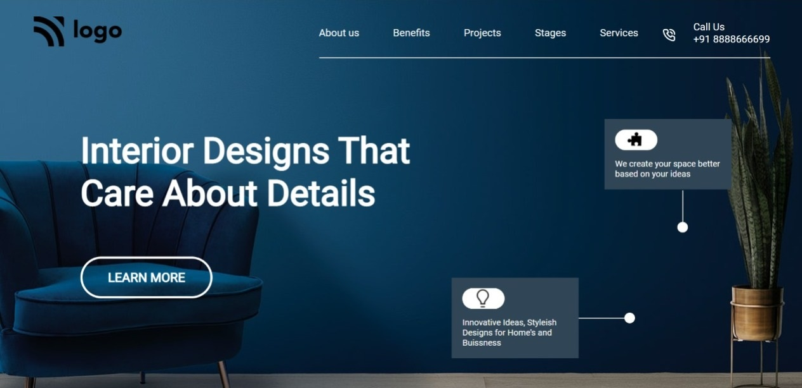

# Assignment-10 
## (Interior design landing Page) 

> In this project, I have used HTML (the Hypertext Markup Language) and CSS (Cascading Style Sheets), which are two of the core technologies for building Web pages. It is a static and non-responsive page.

### As a result of this project, I learn the following:
[LIVE-LINK](https://projectdeveloperlanding.netlify.app/)

- [x] Learned to use background-image with lienar-gradient
- [x] I learned to use ::after and ::before psuedo element
- [x] used svg image path , margin and padding 

#### The duration of the project:4 hour